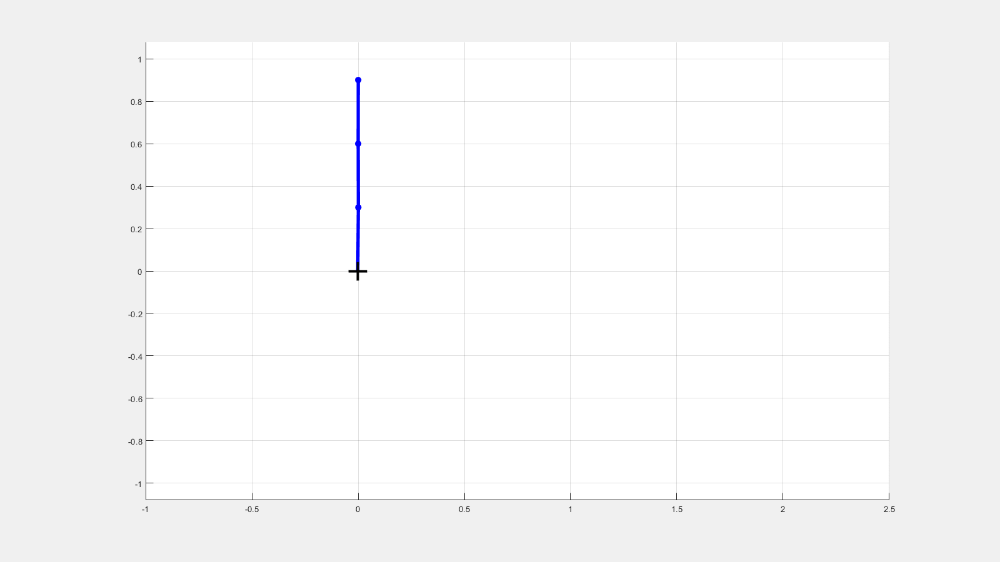

# Illustrative application to the Lagrange formalism of the TU Delft course WI2056LR

## Capabilities and Limitations:
- Set up Euler Lagrange equations symbolically for a pendulum of n slender bars (aka links) (tested up to 20 links). Without damping.
- Solve the Euler Lagrange equations numerically in time using MATLABs ode15s (tested up to 20 links)
- Set up symbolic linearized optimal control (https://en.wikipedia.org/wiki/Linear%E2%80%93quadratic_regulator) assuming 
  1. perfect state feedback (cart position and speed and link orientation and angular speed)
  2. perfect and instantaneous input (linear cart force).
- Numerically solve the controlled system (tested up to 3 links) for the following cases:
  1. stabilize the inverted system against mild disturbances
  2. stabilize the system in its down position from orientations of less than horizontal
  3. do simple side-stepping for both the inverted and the down position
- Plot any of the above cases is (kind of) true time and with the option of gif output.
- (future work) swing up maneuovers inspired by the very inspirational https://www.youtube.com/watch?v=cyN-CRNrb3E
 and https://link-springer-com.tudelft.idm.oclc.org/chapter/10.1007/11529798_15

## Examples:

- Uncontrolled

- Sidestep

 
